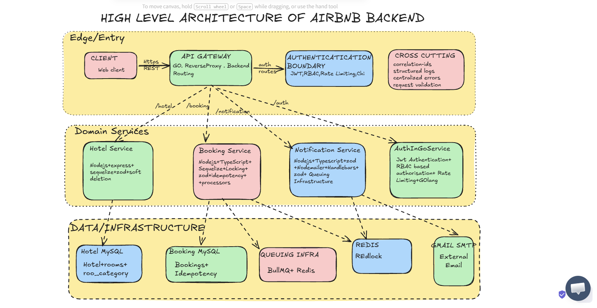
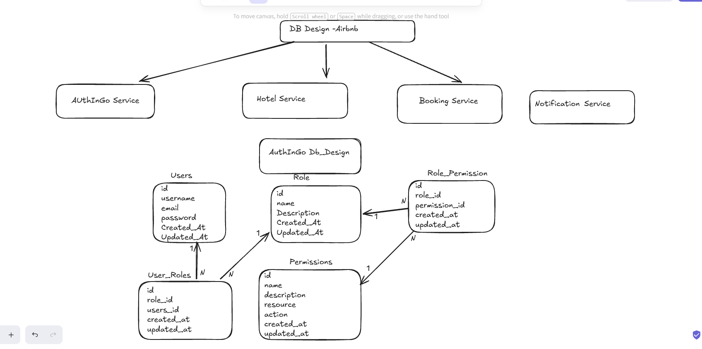
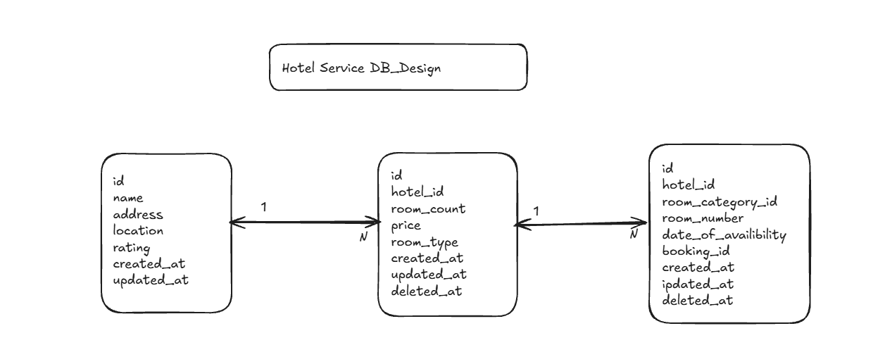
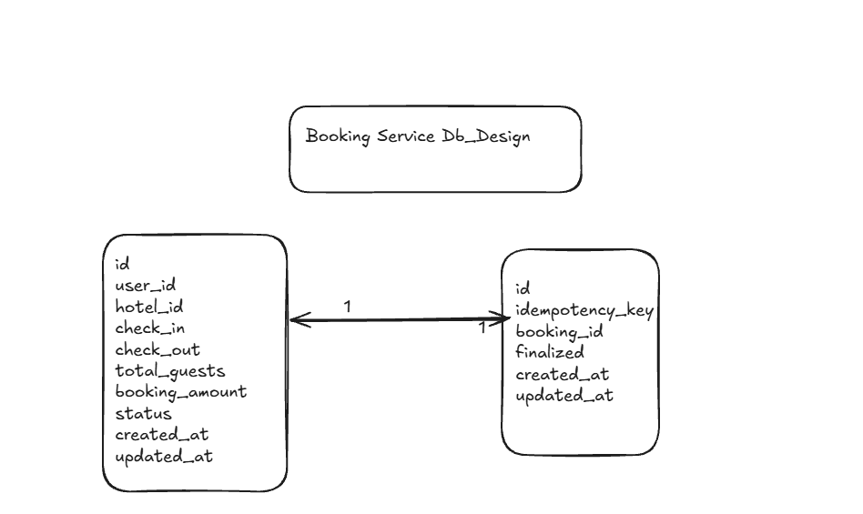
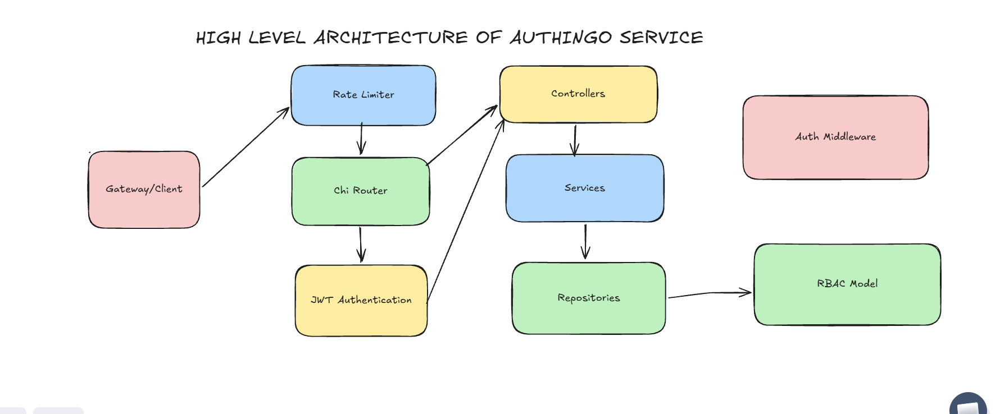
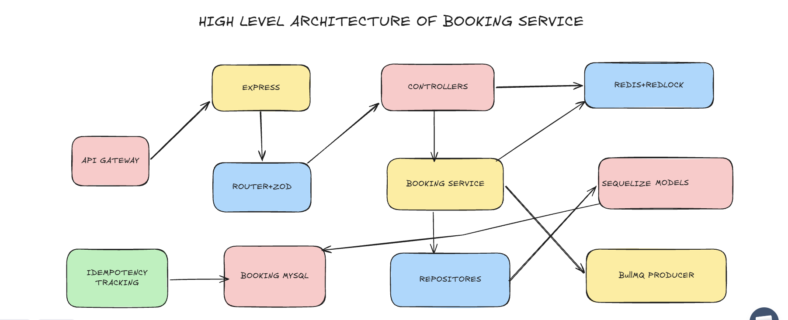
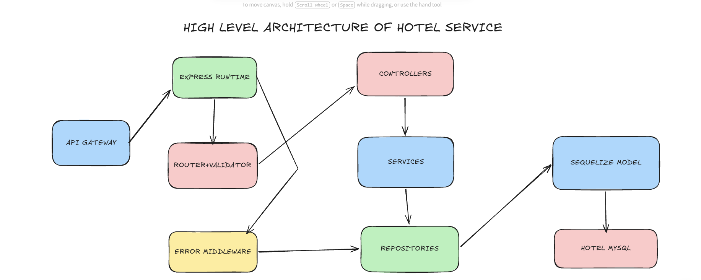

# Airbnb Backend --- Microservices Architecture

A backend system inspired by an Airbnb-style hotel booking platform,
built as a **microservices monorepo**.

The project was developed around practical backend and system-design
problems rather than only CRUD operations: **service separation,
authentication, RBAC, rate limiting, concurrency control, idempotency
tracking, asynchronous email processing, Redis-based distributed
locking, soft deletion, request validation, structured logging, database
migrations, and repository/service/controller layering**.

> **Project focus:** backend engineering, distributed-system concepts,
> database design, concurrency, asynchronous processing, and
> service-oriented architecture.

------------------------------------------------------------------------

## Table of Contents

-   [1. Project Overview](#1-project-overview)
-   [2. Architecture](#2-architecture)
-   [3. Services](#3-services)
-   [4. Major Features](#4-major-features)
-   [5. Concurrency Control](#5-concurrency-control)
-   [6. Idempotency Tracking](#6-idempotency-tracking)
-   [7. Authentication and RBAC](#7-authentication-and-rbac)
-   [8. API Gateway / Reverse Proxy](#8-api-gateway--reverse-proxy)
-   [9. Rate Limiting](#9-rate-limiting)
-   [10. Asynchronous Notifications](#10-asynchronous-notifications)
-   [11. Soft Delete](#11-soft-delete)
-   [12. Validation and Error
    Handling](#12-validation-and-error-handling)
-   [13. Logging and Correlation IDs](#13-logging-and-correlation-ids)
-   [14. Database Design](#14-database-design)
-   [15. Database Tables](#15-database-tables)
-   [16. Request Flows](#16-request-flows)
-   [17. Project Structure](#17-project-structure)
-   [18. Technology Stack](#18-technology-stack)
-   [19. Running the Project](#19-running-the-project)
-   [20. Environment Variables](#20-environment-variables)
-   [21. API Endpoints](#21-api-endpoints)
-   [22. Engineering Decisions](#22-engineering-decisions)
-   [23. Current Implementation Notes](#23-current-implementation-notes)
-   [24. Future Improvements](#24-future-improvements)

------------------------------------------------------------------------

# 1. Project Overview

This project implements an Airbnb-style backend using independently
structured services.

The system is divided into four major services:

  --------------------------------------------------------------------------
  Service                   Language                Main Responsibility
  ------------------------- ----------------------- ------------------------
  **AuthInGoService**       Go                      Authentication, users,
                                                    roles, permissions, JWT,
                                                    rate limiting

  **HotelService**          TypeScript / Node.js    Hotels, room categories,
                                                    rooms, availability,
                                                    soft deletion

  **BookingService**        TypeScript / Node.js    Booking
                                                    creation/confirmation,
                                                    concurrency control,
                                                    idempotency tracking

  **NotificationService**   TypeScript / Node.js    Background email
                                                    processing using BullMQ,
                                                    Redis and Nodemailer
  --------------------------------------------------------------------------

The project follows a layered backend structure:

``` text
Client
   ↓
Routing
   ↓
Controller
   ↓
Service
   ↓
Repository
   ↓
Database / External Infrastructure
```

The goal was to keep business logic separate from HTTP handling and
database access.

------------------------------------------------------------------------

# 2. Architecture

## 2.1 High-Level Architecture

The following diagram represents the overall system architecture
developed for the project.



### Main architectural components

-   Client / Web client
-   API Gateway / reverse-proxy boundary
-   Authentication boundary
-   Hotel Service
-   Booking Service
-   Notification Service
-   AuthInGoService
-   MySQL databases
-   Redis
-   Redlock
-   BullMQ
-   Gmail SMTP
-   Cross-cutting concerns such as:
    -   Correlation IDs
    -   Structured logging
    -   Request validation
    -   Error handling
    -   Rate limiting

------------------------------------------------------------------------

## 2.2 Service Separation

Each service has its own source tree and configuration.

``` text
Airbnb/
├── AuthInGoService/
├── HotelService/
├── BookingService/
├── NotificationService/
└── Todo.md
```

The services are designed so that their application code and
infrastructure concerns remain separated.

------------------------------------------------------------------------

# 3. Services

## 3.1 AuthInGoService

Authentication and authorization service implemented in **Go**.

### Responsibilities

-   User signup
-   User login
-   Password hashing
-   JWT generation
-   JWT authentication middleware
-   User profile access
-   Role management
-   User-role mapping
-   Permission storage
-   Role-permission mapping
-   Rate limiting
-   Reverse-proxy helper

### Architecture


### Main packages

``` text
AuthInGoService/
├── app/
├── config/
│   ├── db/
│   └── env/
├── controllers/
├── db/
│   ├── migrations/
│   └── repositories/
├── dto/
├── middleware/
├── models/
├── router/
├── services/
└── utils/
```

------------------------------------------------------------------------

## 3.2 HotelService

Hotel management service implemented in **Node.js + TypeScript +
Express + Sequelize + MySQL**.

### Responsibilities

-   Create hotels
-   Retrieve hotels
-   Retrieve a hotel by ID
-   Soft delete hotels
-   Store hotel ratings
-   Store room categories
-   Store individual rooms
-   Track room availability dates
-   Repository abstraction
-   DTO validation
-   Sequelize migrations

### Architecture


### Main packages

``` text
HotelService/src/
├── config/
├── controllers/
├── db/
│   ├── migrations/
│   └── models/
├── dto/
├── middlewares/
├── repositories/
├── router/
├── services/
├── utils/
└── validators/
```

------------------------------------------------------------------------

## 3.3 BookingService

Booking service implemented in **Node.js + TypeScript + Express +
Sequelize + MySQL + Redis + Redlock + BullMQ**.

### Responsibilities

-   Create bookings
-   Confirm bookings
-   Booking status management
-   Redis distributed locking
-   Idempotency tracking
-   Database transactions during confirmation
-   Queue producer for notifications
-   Request validation
-   Correlation IDs
-   Structured logging

### Architecture


### Main packages

``` text
BookingService/src/
├── config/
├── controllers/
├── db/
│   ├── migrations/
│   └── models/
├── dto/
├── middlewares/
├── producers/
├── queue/
├── repositories/
├── router/
├── services/
├── utils/
└── validators/
```

------------------------------------------------------------------------

## 3.4 NotificationService

Asynchronous notification service implemented in **Node.js +
TypeScript**.

### Responsibilities

-   Consume email jobs from BullMQ
-   Redis-backed queue processing
-   Render Handlebars templates
-   Send emails through Nodemailer
-   Gmail SMTP integration
-   Worker-based background processing
-   Structured logging
-   Correlation ID support

### Architecture


The notification path is:

``` text
Booking Service
      │
      │ enqueue
      ▼
   BullMQ Queue
      │
      │ Redis stores jobs
      ▼
BullMQ Worker
      │
      ▼
Handlebars Template
      │
      ▼
Mailer Service
      │
      ▼
Gmail SMTP
```

------------------------------------------------------------------------

# 4. Major Features

## 4.1 Microservices Architecture

The system separates business domains into independent services:

``` text
Authentication → AuthInGoService
Hotels         → HotelService
Bookings       → BookingService
Notifications  → NotificationService
```

Benefits:

-   Independent service boundaries
-   Separate databases
-   Technology flexibility
-   Independent deployment potential
-   Failure isolation at the service level
-   Easier domain ownership

------------------------------------------------------------------------

## 4.2 JWT Authentication

The Go authentication service generates a JWT after successful login.

The token contains:

``` text
user_id
email
username
exp
```

The authentication middleware:

1.  Reads the `Authorization` header.
2.  Requires the `Bearer` scheme.
3.  Parses the JWT.
4.  Verifies the HMAC signing method.
5.  Validates the token.
6.  Extracts `user_id` and `email`.
7.  Places the authenticated user ID into the request context.

Protected example:

``` text
GET /profile
```

The profile route uses JWT middleware before reaching the controller.

------------------------------------------------------------------------

## 4.3 Password Hashing

Passwords are not returned in user JSON responses.

The user model explicitly hides the password field during JSON
serialization:

``` go
Password string `json:"-"`
```

The service layer hashes passwords before persistence and verifies the
hash during login.

------------------------------------------------------------------------

## 4.4 RBAC

The authentication database contains a complete role/permission model:

``` text
Users
  │
  ▼
User_Roles
  │
  ▼
Roles
  │
  ▼
Role_Permissions
  │
  ▼
Permissions
```

Permissions contain:

``` text
name
description
resource
action
created_at
updated_at
```

Example permissions seeded by the migration:

``` text
user:read
user:write
user:delete

role:read
role:write
role:delete
role:manage

permission:manage
```

The repository layer contains permission lookup and permission-checking
operations, while the authentication middleware contains role-checking
support.

------------------------------------------------------------------------

# 5. Concurrency Control

Concurrency is one of the major system-design problems addressed in this
project.

## 5.1 The Problem

Imagine two requests attempt to create a booking for the same hotel at
almost the same time:

``` text
Request A ────────┐
                  ├──> Booking creation
Request B ────────┘
```

Without coordination, concurrent requests can race with each other.

The project uses **Redis + Redlock** to coordinate booking creation.

------------------------------------------------------------------------

## 5.2 Redis Distributed Lock

A booking request creates a lock resource based on the hotel:

``` text
hotel:<hotelId>
```

For example:

``` text
hotel:42
```

The BookingService calls:

``` text
redlock.acquire(["hotel:42"], TTL)
```

The Redlock configuration uses:

``` text
retryCount = 0
```

This means a competing request does not wait indefinitely for the same
resource.

Conceptually:

``` text
Request A
   │
   ├── acquire hotel:42
   │
   ├── lock obtained
   │
   └── create booking

Request B
   │
   ├── acquire hotel:42
   │
   └── lock unavailable → fail
```

The lock is configured with a TTL and the implementation intentionally
does not explicitly release it; Redis expiration is used to remove the
short-lived lock.

------------------------------------------------------------------------

## 5.3 Why Distributed Locking?

The important distinction is:

``` text
Application-level synchronization
          ≠
Distributed synchronization
```

A process-local mutex only coordinates requests inside one application
instance.

Redis/Redlock provides a shared coordination mechanism that can be used
when multiple service instances/processes are involved.

------------------------------------------------------------------------

## 5.4 Confirmation Transaction

Booking confirmation is wrapped in a Sequelize transaction:

``` text
BEGIN
   │
   ├── Find booking
   ├── Mark booking CONFIRMED
   ├── Finalize idempotency record
   │
COMMIT
```

If the transaction fails, Sequelize rolls the transaction back.

This gives the confirmation flow an atomic transaction boundary.

------------------------------------------------------------------------

# 6. Idempotency Tracking

The BookingService contains a dedicated `Idempotency` table.

``` text
Idempotency
├── id
├── idemkey
├── Created_At
├── Updated_At
├── finalized
└── bookingId
```

The flow currently implemented is:

``` text
Create booking
      │
      ▼
Generate UUID idempotency key
      │
      ▼
Store key against booking
      │
      ▼
Confirm booking
      │
      ▼
Finalize idempotency record
```

The generated key is based on UUID v4.

### Why track idempotency?

Idempotency is important for operations where a client may retry a
request because of:

-   network failures
-   client timeouts
-   proxy retries
-   duplicate submissions

The database record gives the system a persistent association between an
operation and the booking.

### Important implementation detail

The current implementation provides **idempotency tracking
infrastructure**, but it does **not yet implement the full
client-supplied idempotency-key deduplication pattern**.

In particular:

-   The key is generated by the server.
-   Incoming requests are not currently deduplicated by a
    client-provided `Idempotency-Key` header.
-   `idemkey` itself is not declared unique in the migration.
-   `bookingId` is unique in the `Idempotency` table.

This distinction is documented here so the README describes the actual
implementation rather than overstating it.

------------------------------------------------------------------------

# 7. Authentication and RBAC

## 7.1 Authentication Flow

``` text
Client
  │
  │ POST /login
  ▼
AuthInGoService
  │
  ├── Find user by email
  ├── Compare password hash
  ├── Create JWT
  │
  ▼
JWT returned
```

Subsequent authenticated request:

``` text
Client
  │
  │ Authorization: Bearer <JWT>
  ▼
JwtAuth Middleware
  │
  ├── Validate token
  ├── Extract user_id
  └── Store user ID in context
        │
        ▼
     Controller
```

------------------------------------------------------------------------

## 7.2 Role Model

The database seeds four roles:

``` text
admin
user
manager
guest
```

Role assignment is represented through:

``` text
user_roles
```

Role-permission relationships are represented through:

``` text
role_permissions
```

This avoids storing a list of permissions directly inside a user record.

------------------------------------------------------------------------

# 8. API Gateway / Reverse Proxy

The architecture includes an API Gateway boundary.


The Go service contains a reverse-proxy helper based on Go's:

``` text
net/http/httputil
```

The helper:

-   Parses the backend target URL
-   Creates a `NewSingleHostReverseProxy`
-   Removes a configured path prefix
-   Sets the target host
-   Forwards the authenticated user ID as:

``` text
X-User-Id
```

Conceptually:

``` text
Client
   │
   ▼
Gateway
   │
   ├── /auth        → Auth service
   ├── /hotels      → Hotel service
   ├── /bookings    → Booking service
   └── /notifications → Notification service
```

### Current implementation status

The reverse-proxy capability exists in the codebase, but the current
router does **not** register proxy routes for all domain services.
Therefore, the architecture diagram represents the intended gateway
boundary, while the reverse-proxy helper is the concrete implementation
currently present in the repository.

------------------------------------------------------------------------

# 9. Rate Limiting

The Go authentication service uses:

``` text
golang.org/x/time/rate
```

The limiter is configured as:

``` text
5 requests per second
```

The middleware rejects requests when the limiter does not allow them:

``` text
HTTP 429 Too Many Requests
```

Current implementation:

``` text
Global in-process limiter
        │
        ▼
AuthInGoService routes
```

This protects the Go service from excessive request volume.

> Note: because the limiter is process-local, a multi-instance
> deployment would normally require a distributed/shared rate-limiting
> mechanism if a global limit across instances is desired.

------------------------------------------------------------------------

# 10. Asynchronous Notifications

The notification pipeline uses:

-   BullMQ
-   Redis
-   Nodemailer
-   Gmail SMTP
-   Handlebars

## 10.1 Producer

BookingService contains:

``` text
email.producer.ts
```

which adds an email payload to:

``` text
queue-mailer
```

Payload shape:

``` typescript
{
    to: string,
    subject: string,
    template_id: string,
    params: Record<string, any>
}
```

------------------------------------------------------------------------

## 10.2 Queue

BullMQ stores jobs using Redis.

``` text
BookingService
      │
      ▼
BullMQ Queue
      │
      ▼
Redis
```

------------------------------------------------------------------------

## 10.3 Worker

NotificationService starts a BullMQ worker:

``` text
BullMQ Worker
      │
      ├── Read job
      ├── Render template
      └── Send email
```

The worker listens for:

``` text
completed
failed
```

events for basic job lifecycle logging.

------------------------------------------------------------------------

## 10.4 Template Rendering

The service uses Handlebars.

Current template:

``` text
NotificationService/src/templates/mailer/welcome.hbs
```

The worker:

1.  Receives `template_id`.
2.  Loads the corresponding `.hbs` file.
3.  Compiles it using Handlebars.
4.  Injects `params`.
5.  Passes generated HTML to Nodemailer.

------------------------------------------------------------------------

## 10.5 Gmail SMTP

Nodemailer uses Gmail as the SMTP transport.

``` text
Mailer Service
      │
      ▼
Nodemailer
      │
      ▼
Gmail SMTP
```

------------------------------------------------------------------------

# 11. Soft Delete

HotelService implements a **tombstone / soft-delete** mechanism.

Instead of physically removing a hotel row:

``` sql
DELETE FROM hotel;
```

the service sets:

``` text
deleted_at = current timestamp
```

Example:

``` text
Hotel
├── id
├── name
├── address
├── location
├── rating
├── createdAt
├── updatedAt
└── deleted_at
```

Active hotels are retrieved using:

``` text
deleted_at IS NULL
```

This means deleted records remain in the database while being excluded
from normal active-hotel queries.

Room categories and rooms also contain `deleted_at` fields in their
database schema, and room repository queries filter deleted rooms from
availability-related operations.

------------------------------------------------------------------------

# 12. Validation and Error Handling

## 12.1 Zod Validation

The Node.js services use Zod for request validation.

Example booking validation:

``` text
userId        → number
hotelId       → number
totalGuests   → number >= 1
bookingAmount → number >= 1
```

Invalid requests return:

``` text
HTTP 400
```

------------------------------------------------------------------------

## 12.2 Layered Error Handling

The services define application errors such as:

``` text
BadRequestError
UnauthorizedError
ForbiddenError
NotFoundError
ConflictError
InternalServerError
```

A generic error middleware converts application errors into HTTP
responses.

Example:

``` json
{
  "success": false,
  "message": "..."
}
```

------------------------------------------------------------------------

# 13. Logging and Correlation IDs

The Node.js services use:

``` text
Winston
winston-daily-rotate-file
AsyncLocalStorage
UUID
```

## 13.1 The Problem

Suppose two requests execute concurrently:

``` text
Request A
Request B
```

Their asynchronous operations can interleave:

``` text
A DB
B DB
A Redis
B DB
A response
B response
```

Plain logs can become difficult to correlate.

------------------------------------------------------------------------

## 13.2 Correlation ID

Each request receives a UUID correlation ID.

``` text
Incoming Request
       │
       ▼
Generate UUID
       │
       ▼
AsyncLocalStorage
       │
       ├── Controller
       ├── Service
       ├── Repository
       └── Async operations
```

The logger retrieves the correlation ID from `AsyncLocalStorage`.

This allows logs to be associated with the request that produced them.

------------------------------------------------------------------------

## 13.3 Log Rotation

Winston's daily rotating file transport is configured with:

``` text
Maximum file size: 20 MB
Retention: 14 days
```

Logs are written to:

``` text
logs/%DATE%-app.log
```

Console logging is also enabled.

------------------------------------------------------------------------

# 14. Database Design

The project intentionally separates databases by service boundary.

``` text
                 ┌──────────────────┐
                 │  AuthInGoService  │
                 │    Auth MySQL     │
                 └──────────────────┘

                 ┌──────────────────┐
                 │   HotelService   │
                 │   Hotel MySQL    │
                 └──────────────────┘

                 ┌──────────────────┐
                 │  BookingService  │
                 │  Booking MySQL   │
                 └──────────────────┘

NotificationService does not currently have a relational database.
It uses Redis/BullMQ for queue infrastructure.
```

This avoids making one shared relational database the coupling point for
every service.

------------------------------------------------------------------------

## 14.1 Auth Database Design



The actual schema contains:

``` text
users
role
permissions
role_permissions
user_roles
```

### users

``` text
id
username
email
password
created_at
updated_at
```

### role

``` text
id
name
description
created_at
updated_at
```

### permissions

``` text
id
name
description
resource
action
created_at
updated_at
```

### role_permissions

``` text
id
role_id
permission_id
created_at
updated_at
```

### user_roles

``` text
id
role_id
users_id
created_at
updated_at
```

Relationships:

``` text
users 1 ─── N user_roles N ─── 1 role

role 1 ─── N role_permissions N ─── 1 permissions
```

------------------------------------------------------------------------

## 14.2 Hotel Database Design



The schema contains:

``` text
hotel
room_categories
rooms
```

### hotel

``` text
id
name
address
location
rating
createdAt
updatedAt
deleted_at
```

### room_categories

``` text
id
hotel_id
price
room_type
room_count
created_at
updated_at
deleted_at
```

Supported room types:

``` text
single
double
suite
```

### rooms

``` text
id
room_category_id
hotel_id
room_no
DateOFAVAIlibility
booking_id
created_at
updated_at
deleted_at
```

Relationships:

``` text
hotel 1 ─── N room_categories

hotel 1 ─── N rooms

room_categories 1 ─── N rooms
```

The current schema also stores `booking_id` on the room record for
associating a room with a booking.

------------------------------------------------------------------------

## 14.3 Booking Database Design



The schema contains:

``` text
Bookings
Idempotency
```

### Bookings

``` text
id
userId
hotelId
CreatedAt
UpdatedAt
bookingAmount
status
totalguest
```

Statuses:

``` text
PENDING
CONFIRMED
CANCELLED
```

### Idempotency

``` text
id
idemkey
Created_At
Updated_At
finalized
bookingId
```

Relationship:

``` text
Bookings 1 ─── 1 Idempotency
```

`bookingId` is unique in the idempotency table.

------------------------------------------------------------------------

## 14.4 Notification Database

There is currently **no relational database model in
NotificationService**.

Its persistent infrastructure is:

``` text
NotificationService
        │
        ▼
      BullMQ
        │
        ▼
      Redis
```

Redis stores the queue/job state used by BullMQ.

------------------------------------------------------------------------

# 15. Database Tables

## AuthInGoService

  Table                Purpose
  -------------------- ---------------------------------------
  `users`              User credentials and profile identity
  `role`               Available roles
  `permissions`        Resource/action permissions
  `role_permissions`   Role ↔ permission mapping
  `user_roles`         User ↔ role mapping

------------------------------------------------------------------------

## HotelService

  Table               Purpose
  ------------------- -----------------------------------------
  `hotel`             Hotel information and soft-delete state
  `room_categories`   Room category, pricing and inventory
  `rooms`             Individual rooms and availability dates

------------------------------------------------------------------------

## BookingService

  Table           Purpose
  --------------- -----------------------------------------
  `Bookings`      Booking records and status
  `Idempotency`   Booking operation tracking/finalization

------------------------------------------------------------------------

# 16. Request Flows

## 16.1 User Signup

``` text
Client
  │
  │ POST /signup
  ▼
AuthInGoService
  │
  ▼
User Controller
  │
  ▼
User Service
  │
  ├── Hash password
  │
  ▼
User Repository
  │
  ▼
MySQL users
```

------------------------------------------------------------------------

## 16.2 User Login

``` text
Client
  │
  │ POST /login
  ▼
Controller
  │
  ▼
User Service
  │
  ├── Find user by email
  ├── Verify password
  └── Create JWT
        │
        ▼
     Client
```

------------------------------------------------------------------------

## 16.3 Create Booking

``` text
Client
  │
  │ POST /api/v1/bookings
  ▼
Booking Router
  │
  ▼
Zod Validator
  │
  ▼
Booking Controller
  │
  ▼
Booking Service
  │
  ├── Acquire Redis/Redlock lock
  │       │
  │       └── hotel:<hotelId>
  │
  ├── Create booking
  │
  ├── Generate UUID idempotency key
  │
  └── Store idempotency record
```

------------------------------------------------------------------------

## 16.4 Confirm Booking

``` text
Client
  │
  │ POST /bookings/:bookingId/confirm
  ▼
Booking Controller
  │
  ▼
Booking Service
  │
  ▼
Sequelize Transaction
  │
  ├── Load booking
  ├── Set CONFIRMED
  ├── Finalize idempotency record
  │
  ▼
COMMIT
```

------------------------------------------------------------------------

## 16.5 Email Processing

``` text
BookingService
      │
      │ add job
      ▼
BullMQ Queue
      │
      ▼
Redis
      │
      ▼
NotificationService Worker
      │
      ├── Render Handlebars template
      │
      ▼
Mailer Service
      │
      ▼
Gmail SMTP
```

------------------------------------------------------------------------

# 17. Project Structure

``` text
Airbnb/
│
├── AuthInGoService/
│   ├── app/
│   ├── config/
│   ├── controllers/
│   ├── db/
│   │   ├── migrations/
│   │   └── repositories/
│   ├── dto/
│   ├── middleware/
│   ├── models/
│   ├── router/
│   ├── services/
│   ├── utils/
│   ├── go.mod
│   ├── main.go
│   └── makefile
│
├── HotelService/
│   ├── src/
│   │   ├── config/
│   │   ├── controllers/
│   │   ├── db/
│   │   ├── dto/
│   │   ├── middlewares/
│   │   ├── repositories/
│   │   ├── router/
│   │   ├── services/
│   │   ├── utils/
│   │   └── validators/
│   ├── package.json
│   └── tsconfig.json
│
├── BookingService/
│   ├── src/
│   │   ├── config/
│   │   ├── controllers/
│   │   ├── db/
│   │   ├── dto/
│   │   ├── middlewares/
│   │   ├── producers/
│   │   ├── queue/
│   │   ├── repositories/
│   │   ├── router/
│   │   ├── services/
│   │   ├── utils/
│   │   └── validators/
│   ├── package.json
│   └── tsconfig.json
│
└── NotificationService/
    ├── src/
    │   ├── config/
    │   ├── consumers/
    │   ├── controllers/
    │   ├── dto/
    │   ├── middlewares/
    │   ├── producers/
    │   ├── queue/
    │   ├── services/
    │   ├── templates/
    │   ├── router/
    │   ├── utils/
    │   └── validators/
    ├── package.json
    └── tsconfig.json
```

------------------------------------------------------------------------

# 18. Technology Stack

## Backend

-   Node.js
-   TypeScript
-   Express.js
-   Go
-   Chi router

## Databases

-   MySQL
-   Sequelize ORM
-   Go `database/sql`
-   MySQL driver

## Distributed / Infrastructure

-   Redis
-   Redlock
-   BullMQ

## Authentication / Security

-   JWT
-   HMAC-SHA based JWT signing
-   Password hashing
-   RBAC
-   Rate limiting

## Validation

-   Zod

## Notifications

-   Nodemailer
-   Gmail SMTP
-   Handlebars

## Observability

-   Winston
-   Daily rotating logs
-   Correlation IDs
-   AsyncLocalStorage

## Database migrations

-   Sequelize CLI
-   Goose-style SQL migrations for Go service

------------------------------------------------------------------------

# 19. Running the Project

## Prerequisites

Install:

``` text
Node.js
npm
Go
MySQL
Redis
Goose
```

Docker can also be used to run infrastructure such as Redis/MySQL.

------------------------------------------------------------------------

## 19.1 AuthInGoService

``` bash
cd AuthInGoService
go mod download
go run .
```

The default Go service address is:

``` text
:8080
```

### Goose migrations

The project includes a Makefile:

``` bash
make migration-up
```

or directly:

``` bash
goose -dir db/migrations mysql "<MYSQL_CONNECTION_STRING>" up
```

------------------------------------------------------------------------

## 19.2 HotelService

``` bash
cd HotelService
npm install
npm run migrate
npm run dev
```

Production-style start:

``` bash
npm start
```

------------------------------------------------------------------------

## 19.3 BookingService

``` bash
cd BookingService
npm install
npx sequelize-cli db:migrate
npm run dev
```

Production-style start:

``` bash
npm start
```

BookingService also requires Redis.

------------------------------------------------------------------------

## 19.4 NotificationService

``` bash
cd NotificationService
npm install
npm run dev
```

Production-style start:

``` bash
npm start
```

NotificationService requires Redis and mailer credentials.

------------------------------------------------------------------------

# 20. Environment Variables

Do not commit `.env` files.

## AuthInGoService

``` env
PORT=:8080

DB_USER=root
DB_PWD=your_password
DB_ADDR=127.0.0.1:3306
DB_NAME=AUTH_DEV

JWT_SECRET_KEY=your_secret
```

------------------------------------------------------------------------

## HotelService

``` env
PORT=3001

DB_USERNAME=root
DB_PASSWORD=your_password
DB_NAME=database_development
DB_HOST=127.0.0.1
```

------------------------------------------------------------------------

## BookingService

``` env
PORT=3001

DB_USER=root
DB_PWD=your_password
DB_NAME=airbnb_booking_service
DB_HOST=127.0.0.1

REDIS_URL=redis://localhost:6379
TTL=6000
```

`TTL` controls the Redlock acquisition lifetime used for the hotel
booking resource.

------------------------------------------------------------------------

## NotificationService

``` env
PORT=3001

REDIS_HOST=localhost
REDIS_PORT=6379

MAILER_USER=your_email@gmail.com
MAILER_PWD=your_mailer_password
```

> When running all Node.js services simultaneously, assign different
> ports because the current configuration defaults several services to
> port `3001`.

------------------------------------------------------------------------

# 21. API Endpoints

## AuthInGoService

  Method     Endpoint          Purpose
  ---------- ----------------- ----------------------------------
  `GET`      `/ping`           Health/ping endpoint
  `POST`     `/signup`         Create user
  `POST`     `/login`          Authenticate and receive JWT
  `GET`      `/profile`        Get authenticated user's profile
  `GET`      `/roles`          Get all roles
  `GET`      `/roles/{id}`     Get role
  `POST`     `/roles`          Create role
  `DELETE`   `/roles/{id}`     Delete role
  `POST`     `/roles/assign`   Assign role
  `POST`     `/roles/remove`   Remove role

------------------------------------------------------------------------

## HotelService

Base path:

``` text
/api/v1
```

  Method     Endpoint        Purpose
  ---------- --------------- -------------------
  `GET`      `/ping`         Health/ping
  `POST`     `/hotels`       Create hotel
  `GET`      `/hotels/all`   Get active hotels
  `GET`      `/hotels/:id`   Get hotel by ID
  `DELETE`   `/hotels/:id`   Soft delete hotel

------------------------------------------------------------------------

## BookingService

Base path:

``` text
/api/v1
```

  Method   Endpoint                         Purpose
  -------- -------------------------------- -----------------
  `GET`    `/ping`                          Health/ping
  `POST`   `/bookings`                      Create booking
  `POST`   `/bookings/:bookingId/confirm`   Confirm booking

------------------------------------------------------------------------

## NotificationService

Base path:

``` text
/api/v1
```

  Method   Endpoint   Purpose
  -------- ---------- -------------
  `GET`    `/ping`    Health/ping

Email processing is primarily worker/queue based rather than exposed as
a normal public REST API.

------------------------------------------------------------------------

# 22. Engineering Decisions

## 22.1 Why separate services?

Different domains have different responsibilities and scaling
characteristics.

``` text
Auth       → security / identity
Hotel      → inventory / catalog
Booking    → consistency / concurrency
Notification → asynchronous work
```

This allows each domain to evolve independently.

------------------------------------------------------------------------

## 22.2 Why Redis?

Redis is used for fast shared infrastructure.

In this project it supports:

``` text
Redlock
BullMQ
Queue state
```

------------------------------------------------------------------------

## 22.3 Why Redlock?

Booking creation is a shared-resource concurrency problem.

A Redis distributed lock provides coordination around the hotel booking
resource instead of relying only on an in-process lock.

------------------------------------------------------------------------

## 22.4 Why BullMQ?

Email delivery does not need to block the main booking request.

Instead of:

``` text
HTTP Request
   ↓
Create Booking
   ↓
Send Email
   ↓
HTTP Response
```

the architecture can use:

``` text
HTTP Request
   ↓
Create Booking
   ↓
Enqueue Email
   ↓
HTTP Response

              Background
                  ↓
              Worker
                  ↓
              Send Email
```

This separates request processing from external email delivery.

------------------------------------------------------------------------

## 22.5 Why repository pattern?

Database access is isolated from business logic.

Example:

``` text
Controller
    ↓
Service
    ↓
Repository
    ↓
Sequelize
    ↓
MySQL
```

This improves separation of concerns and makes it easier to change
persistence implementations.

The Go service also uses interfaces for repositories, allowing
service-layer dependencies to target abstractions rather than concrete
database implementations.

------------------------------------------------------------------------

## 22.6 Why migrations?

Database schemas are versioned through migration files.

Examples:

``` text
create hotels table
add ratings
add deleted_at
create room categories
create rooms
create bookings
create idempotency table
create users
create roles
create permissions
create role_permissions
create user_roles
```

This makes schema evolution reproducible instead of relying on manually
created databases.

------------------------------------------------------------------------

# 23. Current Implementation Notes

This section intentionally documents the difference between the
architecture and what is currently wired in code.

### 1. API Gateway

A Go reverse-proxy helper exists, but the current router does not
register all domain-service proxy routes.

### 2. RBAC

The database and repository layers contain role/permission functionality
and role-checking middleware support. However, the current router does
not consistently apply authorization middleware to all role-management
routes.

### 3. Idempotency

The project has an idempotency table and tracks/finalizes an idempotency
record. It is not yet a complete client-supplied idempotency-key
deduplication implementation.

### 4. Booking confirmation locking

Confirmation is wrapped in a Sequelize transaction. The current
repository uses the transaction for the booking read/update but does not
explicitly request a database row lock such as `SELECT ... FOR UPDATE` /
Sequelize's `lock` option.

### 5. Notification integration

The producer and worker infrastructure exists across BookingService and
NotificationService. The current BookingService startup code also
contains a sample notification enqueue. A complete production flow would
enqueue a real notification from the booking lifecycle rather than
relying on the sample startup job.

### 6. Hotel/room APIs

The database models and repository functionality for room categories and
rooms are present, including availability-oriented queries, but the
current public router primarily exposes hotel CRUD/soft-delete
endpoints.

### 7. Ports

Several Node.js services currently default to port `3001`. Running them
simultaneously requires separate environment-configured ports.

These notes are included so the README remains technically accurate and
does not claim features that are only partially wired.

------------------------------------------------------------------------

# 24. Future Improvements

The architecture provides a foundation for extending the system.

Possible next steps:

-   Complete API Gateway route registration.
-   Propagate JWT authentication and user identity consistently through
    the gateway.
-   Apply RBAC middleware to protected administrative routes.
-   Add client-supplied idempotency keys.
-   Make the idempotency key unique at the database level.
-   Return the original response for duplicate idempotent requests.
-   Scope booking locks by hotel + room category + date instead of the
    entire hotel.
-   Explicitly release Redlock locks after successful/failed critical
    sections where appropriate.
-   Add explicit database row locking where required for booking
    inventory.
-   Add booking-to-hotel service communication for availability
    verification.
-   Complete room/room-category REST APIs.
-   Add authentication/authorization to HotelService and BookingService.
-   Add automated unit/integration tests.
-   Add Docker Compose for MySQL and Redis.
-   Add health/readiness endpoints for every service.
-   Add centralized metrics/tracing.
-   Add retries and dead-letter handling for notification jobs.
-   Add email templates for booking confirmation/cancellation.
-   Add API documentation using OpenAPI/Swagger.
-   Add CI/CD pipelines.
-   Add service-level configuration validation.
-   Add distributed rate limiting if multiple gateway instances are
    deployed.

------------------------------------------------------------------------

# Architecture & Database Reference Images

For quick reference, all diagrams supplied with the project are included
below.

## Overall System


## Auth Service



## Booking Service



## Hotel Service



## Notification Service


## Auth Database


## Hotel Database


## Booking Database


------------------------------------------------------------------------

## Summary

This project demonstrates backend engineering concepts beyond basic
CRUD:

``` text
Microservices
     +
Authentication
     +
JWT
     +
RBAC
     +
Rate Limiting
     +
API Gateway / Reverse Proxy
     +
MySQL
     +
Sequelize
     +
Repository Pattern
     +
Soft Delete
     +
Redis
     +
Distributed Locking
     +
Concurrency Control
     +
Idempotency Tracking
     +
Transactions
     +
BullMQ
     +
Asynchronous Workers
     +
Email Delivery
     +
Request Validation
     +
Structured Logging
     +
Correlation IDs
     +
Database Migrations
```

The main engineering focus of the project is the interaction between
**service boundaries, data consistency, concurrency, asynchronous
processing, and backend infrastructure** rather than simply implementing
REST endpoints.
